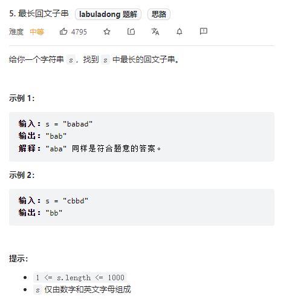

# 如何寻找最长回文子串


## 我的解法:

```java
class Solution {
    public String longestPalindrome(String s) {
        int len = s.length();
        boolean[][] k = new boolean[len][len];
        int maxDis = -1;
        String result = s;
        for (int dis = 0; dis < len; dis++) {
            for (int i = 0; i < len - dis; i++) {
                int j = i + dis;
                if (dis == 0) {
                    k[i][j] = true;
                } else if (dis == 1) {
                    k[i][j] = (s.charAt(i) == s.charAt(j));
                } else {
                    k[i][j] = ((s.charAt(i) == s.charAt(j)) && k[i + 1][j - 1]);
                }
                if (maxDis < dis && k[i][j]) {
                    maxDis = dis;
                    result = s.substring(i, j+1);
                }
            }
        }
        return result;
    }
}
/*
k[i][j] 代表是否是i~j是否是回文
i j 范围 0~len-1
k[i][i] = true;
k[i][j] = i==j && (k[i+1][j-1] == true)
*/
```

## 其他思路分析
### 1.动态规划（官方）
动态规划转移方程:  
P(i, j) = P(i+1, j-1) ^ (S[i] == S[j])  
上面针对子串长度大于2的前提  
考虑边界条件：  
子串长度为1 - 是回文串  
子串长度为2 - 只要两个字母相同，就是回文串  
可以得到如下公式：  
P(i, i) = true  
P(i, i+1) = (S[i] == S[i+1])  
最终答案为所有P(i, j) = true中j-i+1最大值对应的子串  
需要注意的关键点：  
状态转移方程中，我们是从长度较短的字符串向长度较长的字符串进行转移的，所以一定要注意动态规划的循环顺序。  


```java
/* 官方题解*/
public class Solution {
    public String longestPalindrome(String s) {
        int len = s.length();
        if (len < 2) {
            return s;
        }
        int maxLen = 1;
        int begin = 0;
        // dp[i][j] 表示 s[i..j] 是否是回文串
        boolean[][] dp = new boolean[len][len];
        // 初始化：所有长度为 1 的子串都是回文串
        for (int i = 0; i < len; i++) {
            dp[i][i] = true;
        }
        char[] charArray = s.toCharArray();
        // 递推开始
        // 先枚举子串长度
        for (int L = 2; L <= len; L++) {
            // 枚举左边界，左边界的上限设置可以宽松一些
            for (int i = 0; i < len; i++) {
                // 由 L 和 i 可以确定右边界，即 j - i + 1 = L 得
                int j = L + i - 1;
                // 如果右边界越界，就可以退出当前循环
                if (j >= len) {
                    break;
                }
                if (charArray[i] != charArray[j]) {
                    dp[i][j] = false;
                } else {
                    if (j - i < 3) {
                        dp[i][j] = true;
                    } else {
                        dp[i][j] = dp[i + 1][j - 1];
                    }
                }
                // 只要 dp[i][L] == true 成立，就表示子串 s[i..L] 是回文，此时记录回文长度和起始位置
                if (dp[i][j] && j - i + 1 > maxLen) {
                    maxLen = j - i + 1;
                    begin = i;
                }
            }
        }
        return s.substring(begin, begin + maxLen);
    }
}
```
**发现**
- char[] charArray = s.toCharArray(); 提前把s转化为数组，节省了每一次调用s.charAt的时长。
- s.substring()位置放在最后，过程中只记录开始位置和长度，可以节省substring调用次数，优化执行效率。

### 2.中心扩散 （官方）（labuladong）
从方法1中可以观察到一个状态转移链:  
P(i, j) <- P(i+1, j-1) <- P(i+2, j-2) <- ……<- 某一边界情况  
特点是所有的状态在转移的时候可能性都是唯一的。  
我们可以从每一种边界情况开始扩展，也可以得出所有的状态对应的答案。  
边界情况即子串长度为1或者2的情况。  
直白来说 ：我们枚举所有的【回文中心】并尝试【拓展】，直到无法拓展为止。对所有的长度求出最大值就是最终答案。  
```java
/* 官方题解*/
class Solution {
    public String longestPalindrome(String s) {
        if (s == null || s.length() < 1) {
            return "";
        }
        int start = 0, end = 0;
        for (int i = 0; i < s.length(); i++) {
            int len1 = expandAroundCenter(s, i, i);
            int len2 = expandAroundCenter(s, i, i + 1);
            int len = Math.max(len1, len2);
            if (len > end - start) {
                start = i - (len - 1) / 2;
                end = i + len / 2;
            }
        }
        return s.substring(start, end + 1);
    }
    public int expandAroundCenter(String s, int left, int right) {
        while (left >= 0 && right < s.length() && s.charAt(left) == s.charAt(right)) {
            --left;
            ++right;
        }
        return right - left - 1;
    }
}
```
参考：
[力扣官方题解](https://leetcode-cn.com/problems/longest-palindromic-substring/solution/zui-chang-hui-wen-zi-chuan-by-leetcode-solution/)


